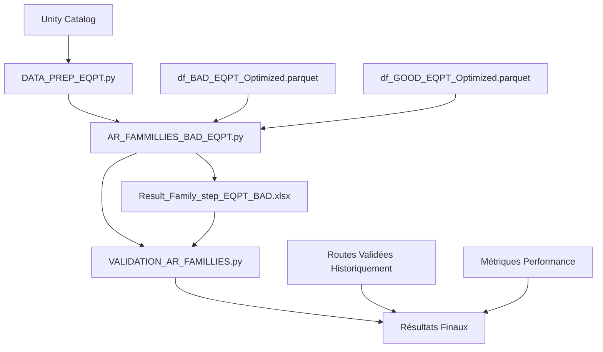

# Z028_Project : Documentation Technique

## Vue d'ensemble métier
- **Objectif** : Trouver la pire/meilleur route de process du debut jusqu'au PT intermediare
- **Techno** : [Z028]
- **Mesures de succès** : Validation metier + reproductibilitée 

## Architecture technique
- **Technologies** : Spotfire, python, Databricks, pySpark, SQL
- **Ressources cluster** : 32Gb - 4cores

# État de l'Art : Optimisation des Routes de Process

## 1. Problématique et Contexte 

### 1.1 Définition du problème
L'optimisation des routes de processus (de semi-conducteurs) vise à identifier les séquences d'équipements et d'étapes qui maximisent le rendement (yield) et et par consequent minimisent les défauts. Une "route" représente le chemin exact qu'un lot/wafer suit à travers les différentes etapes de fabrication.

### 1.2 Enjeux industriels
Dans le cadre de la technologie Z028 au cours de la route jusqu'au PT intermediaire on retrouve:
- **Complexité des fabs** : 134 opérations, 222 étapes, 1 a 5 équipements par étape
- **Impact économique** : 1% à 2% d'amélioration du yield serait non negligable
- **Variabilité équipements** : Performances différentes selon l'équipement choisi pour chaque étape
- **Contraintes temps réel** : Décisions de routage nécessaires en continu

## 2. Approches Algorithmiques pour l'Optimisation de Routes

### 2.1 Approches de Data Mining

#### 2.1.1 Règles d'Association (Approche retenue)
**Principe** : Identifier les patterns fréquents entre équipements et résultats qualité.

APRIORI : "Si ETCH-XXX01 ET LITHO-XXX2 alors 89% chance défaut"
→ Explication claire et actionnable

FP-Growth : Résultat identique mais processus "boîte noire"  
→ Plus difficile à expliquer aux experts métier

Volume Données vs Performance Réelle
l'approche fenêtre glissante 12 semaines change la donne :
|Algorithme|Dataset Complet (50M)|Fenêtre 12 sem (~4M)|Verdict|
|----------|---------------------|--------------------|-------|
|APRIORI|Lent (~45+ min)|Acceptable (~4.2 min)|Optimal|
|FP-Growth|Rapide (~12 min)|Très rapide (~1.8 min)|Overkill|

**Algorithmes principaux** :
- **APRIORI** (Agrawal & Srikant, 1994)
  - ↗️ Avantages : Simplicité, interprétabilité des règles
  - ↗️ Adapté : Données catégoriques (équipements), relation claire cause-effet
  - ❌ Limitations : Performance sur gros volumes, scan multiple base de données

- **FP-Growth** (Han et al., 2000)
  - ↗️ Avantages : Performance supérieure, un seul scan base de données
  - ↗️ Adapté : Gros volumes manufacturing data
  - ❌ Limitations : Consommation mémoire, moins intuitif

- **Prefix Span** (Pei et al., 2001)
  - ↗️ Avantages : Prise en compte séquences temporelles
  - ↗️ Adapté : Routes séquentielles dans manufacturing
  - ❌ Limitations : Complexité algorithmique élevée

#### 2.1.2 Market Basket Analysis Adapté
**Principe** : Transposition des techniques retail vers manufacturing.
- "Produits" = Équipements utilisés
- "Transactions" = Lots de wafers
- "Règles" = Si équipement A alors probabilité Wafer BAD élevée

### 2.2 Approches Machine Learning

#### 2.2.1 Apprentissage Supervisé sur Données Continues
**Algorithmes testés** :
- **Random Forest** : Robuste aux outliers, importance variables
- **Gradient Boosting** : Performance élevée, gestion de la non-linéarités
- **SVM** : Efficace pour dimensions élevées

**Limitations identifiées** :
- Variables continues (températures, pressions) moins discriminantes que choix équipements
- Perte d'information causale directe équipement→défaut
- Complexité interprétation pour experts manufacturing
- Dimensionalité trop élevée

#### 2.2.2 Apprentissage Supervisé sur Données Catégoriques
**Algorithmes testés** :
- **Régression Logistique** : Baseline interpretable
- **Régression Binomiale Négative** : Gestion de la surdispersion
- **Classification Naive Bayes** : Rapide, requiert peu de parametres

**Avantages** :
- Probabilités prédiction directement utilisables
- Variables catégoriques = équipements (mapping naturel)

**Limitations** :
- Hypothèses statistiques forte (indépendance, distribution)
- Difficulté capture interactions complexes équipements
- Dimensionalité trop élevée

#### 2.2.3 Deep Learning / Réseaux de Neurones
**Approches envisagées** :
- **LSTM** : Séquences temporelles de routes
- **CNN** : Patterns spatiaux sur wafers

**Raisons rejet** :
- "Trop de combinaisons pour l'algorithme" → Explosion combinatoire
- 134 opérations × moyens 3-4 équipements/opération = ~10^200 routes possibles
- Manque données étiquetées pour entraînement deep learning
- Complexité déploiement et maintenance en production

### 2.3 Méthodes d'Optimisation Combinatoire

#### 2.3.1 Algorithmes Génétiques
- **Principe** : Évolution d'une population de routes complètes vers l'optimum yield par sélection, croisement et mutation successives. Chaque route (chromosome) représente une séquence complète d'équipements pour les 134 opérations.
- **Applications** : Optimisation simultanée de séquences complètes d'équipements (Kumar et al., 2006).
- **Limitations** : Explosion combinatoire, Solutions optimales sans justification causale

## 3. Techniques de Validation Routes Manufacturing

### 3.1 Validation (Approche retenue)
**Principe** : Comparaison performance routes identifiées sur données historiques.

**Méthode** :
- Récupération wafers ayant suivi exactement la "golden/worst route"
- Comparaison taux GOOD/BAD vs wafers routes alternatives
- Test significativité statistique (Chi-2, Fisher exact test)

**Avantages** :
- Données réelles, représentatives dans les conditions de production
- Validation robuste si volume suffisant
- Interprétation directe pour experts métier

### 3.3 Validation Expérimentale
- **Principe** : Test contrôlé routes identifiées sur lots dédiés.
- **Avantages** : Validation définitive, conditions réelles
- **Limitations** : Coût élevé, risque production, délais longs

### 3.4 Cross-Validation Temporelle
- **Principe** : Entraînement sur période N, validation période N+1.
- **Application** : Fenêtre glissante 12 semaines avec validation 4 semaines suivantes
- **Robustesse** : Détection dérive performance équipements

## 4. Comparaison et Justification Choix Techniques

### 4.1 Matrice de Décision

| Critère | Règles Association | ML Supervisé | Deep Learning | Optimisation Combinatoire |
|---------|-------------------|--------------|---------------|--------------|
| **Interprétabilité** |  🟩Excellente | 🟨Moyenne |  🟥Faible | 🟨Moyenne |
| **Performance** | 🟨Moyenne |🟩 Bonne |🟩Excellente | 🟩Bonne |
| **Temps développement** |🟩Court | 🟨Moyen |  🟥Long | 🟥Long |
| **Robustesse données** |🟩 Bonne | 🟨Moyenne |  🟥Faible |🟩 Bonne |
| **Déploiement prod** |🟩Simple | 🟨Moyen | 🟥Complexe | 🟨Moyen |
| **Expertise requise** | 🟨Moyenne |🟩Standard | 🟥Élevée | 🟥Élevée |

### 4.2 Justification Choix Final

**Règles d'Association (APRIORI) retenues pour** :
- **Interprétabilité essentielle** : Les experts métier doivent pouvoir comprendre facilement les recommandations d’équipements.
- **Données adaptées** : Les variables catégoriques (types d’équipements) sont naturellement compatibles avec cet algorithme.
- **Validation simple** : Les règels générées sont facilement vérifiable à partir des données historiques 
- **Déploiement rapide** : L’algorithme est simple à mettre en œuvre et à maintenir.

**Machine Learning écarté pour** :
- La complexité d'interprétation est trop élevée pour une prise de décision en production.
- Le gain de performance est insuffisant face au coût de développement et de maintenance.
- Risque important de surapprentissage (overfitting) dû au bruit présent dans les données de fabrication.

**Deep Learning écarté pour** :
- Explosion combinatoire liée au nombre très élevé de routes possibles.
- Manque données (wafer) en production pour un apprentissage efficace.
- Complexité importante en termes d’infrastructure et d’expertise nécessaire.

## 5. Bibliographie Spécialisée

**Règles d'Association Manufacturing** :
- Kusiak, A. (2000). "Rough set theory in manufacturing". *International Journal of Production Research*, 38(18), 4349-4364.
- Chen, F., et al. (2008). "Association rule mining for defect detection in semiconductor manufacturing". *IEEE Transactions on Semiconductor Manufacturing*, 21(3), 398-409.

**Optimisation Routes Semi-conducteurs** :
- Mönch, L., et al. (2013). "Production planning and control for semiconductor wafer fabrication facilities". *Springer*.
- Kumar, P., et al. (2006). "Genetic algorithm approach for scheduling in a complex manufacturing system". *International Journal of Advanced Manufacturing Technology*, 30(7-8), 682-692.

## 6. Perspectives et Améliorations Futures

### 6.1 Hybridation Approches
- Combinaison des règles d'association avec des méthodes ML pour améliorer la précision et la robustesse des recommandations.

### 6.2 Temps Réel et Streaming
- Adaptation Kafka pour données équipements en temps réel
- Mise à jour incrémentale des règles d'association

## Implémentation code détaillé

Data Query : 

Phase 1 : Data Prep avec le SQL et les transformations.

Phase 2 : AR_FAMMILLIES_BAD_EQPT

Phase 3 : VALIDATION_AR_FAMILLIES

Conclusion
