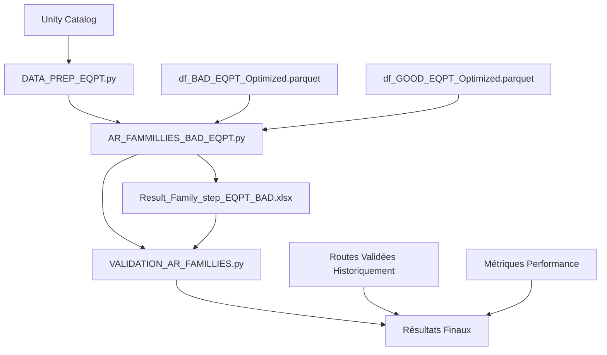

# Z028_Project : Documentation Technique

## Vue d'ensemble métier
- **Objectif** : Trouver la pire/meilleur route de process du debut jusqu'au PT intermediare
- **Techno** : [Z028]
- **Mesures de succès** : Validation metier + reproductibilitée 

## Architecture technique
- **Technologies** : Spotfire, python, Databricks, pySpark, SQL
- **Ressources cluster** : 32Gb - 4cores


# État de l'Art : Optimisation des Routes de Process

## 1. Problématique et Contexte 

### 1.1 Définition du problème
L'optimisation des routes de processus (de semi-conducteurs) vise à identifier les séquences d'équipements et d'étapes qui maximisent le rendement (yield) et et par consequent minimisent les défauts. Une "route" représente le chemin exact qu'un lot/wafer suit à travers les différentes etapes de fabrication.

### 1.2 Enjeux industriels
Dans le cadre de la technologie Z028 au cours de la route jusqu'au PT intermediaire on retrouve:
- **Complexité des fabs** : 134 opérations, 222 étapes, 1 a 5 équipements par étape
- **Impact économique** : 1% à 2% d'amélioration du yield serait non negligable
- **Variabilité équipements** : Performances différentes selon l'équipement choisi pour chaque étape
- **Contraintes temps réel** : Décisions de routage nécessaires en continu

## 2. Approches Algorithmiques pour l'Optimisation de Routes

### 2.1 Approches de Data Mining

#### 2.1.1 Règles d'Association (Approche retenue)
**Principe** : Identifier les patterns fréquents entre équipements et résultats qualité.

APRIORI : "Si ETCH-XXX01 ET LITHO-XXX2 alors 89% chance défaut"
→ Explication claire et actionnable

FP-Growth : Résultat identique mais processus "boîte noire"  
→ Plus difficile à expliquer aux experts métier

Volume Données vs Performance Réelle
l'approche fenêtre glissante 12 semaines change la donne :
|Algorithme|Dataset Complet (50M)|Fenêtre 12 sem (~4M)|Verdict|
|----------|---------------------|--------------------|-------|
|APRIORI|Lent (~45+ min)|Acceptable (~4.2 min)|Optimal|
|FP-Growth|Rapide (~12 min)|Très rapide (~1.8 min)|Overkill|

**Algorithmes principaux** :
- **APRIORI** (Agrawal & Srikant, 1994)
  - ↗️ Avantages : Simplicité, interprétabilité des règles
  - ↗️ Adapté : Données catégoriques (équipements), relation claire cause-effet
  - ❌ Limitations : Performance sur gros volumes, scan multiple base de données

- **FP-Growth** (Han et al., 2000)
  - ↗️ Avantages : Performance supérieure, un seul scan base de données
  - ↗️ Adapté : Gros volumes manufacturing data
  - ❌ Limitations : Consommation mémoire, moins intuitif

- **Prefix Span** (Pei et al., 2001)
  - ↗️ Avantages : Prise en compte séquences temporelles
  - ↗️ Adapté : Routes séquentielles dans manufacturing
  - ❌ Limitations : Complexité algorithmique élevée


#### 2.1.2 Market Basket Analysis Adapté
**Principe** : Transposition des techniques retail vers manufacturing.
- "Produits" = Équipements utilisés
- "Transactions" = Lots de wafers
- "Règles" = Si équipement A alors probabilité Wafer BAD élevée

### 2.2 Approches Machine Learning

#### 2.2.1 Apprentissage Supervisé sur Données Continues
**Algorithmes testés** :
- **Random Forest** : Robuste aux outliers, importance variables
- **Gradient Boosting** : Performance élevée, gestion de la non-linéarités
- **SVM** : Efficace pour dimensions élevées

**Limitations identifiées** :
- Variables continues (températures, pressions) moins discriminantes que choix équipements
- Perte d'information causale directe équipement→défaut
- Complexité interprétation pour experts manufacturing
- Dimensionalité trop élevée

#### 2.2.2 Apprentissage Supervisé sur Données Catégoriques
**Algorithmes testés** :
- **Régression Logistique** : Baseline interpretable
- **Régression Binomiale Négative** : Gestion de la surdispersion
- **Classification Naive Bayes** : Rapide, requiert peu de parametres

**Avantages** :
- Probabilités prédiction directement utilisables
- Variables catégoriques = équipements (mapping naturel)

**Limitations** :
- Hypothèses statistiques forte (indépendance, distribution)
- Difficulté capture interactions complexes équipements
- Dimensionalité trop élevée

#### 2.2.3 Deep Learning / Réseaux de Neurones
**Approches envisagées** :
- **LSTM** : Séquences temporelles de routes
- **CNN** : Patterns spatiaux sur wafers

**Raisons rejet** :
- "Trop de combinaisons pour l'algorithme" → Explosion combinatoire
- 134 opérations × moyens 3-4 équipements/opération = ~10^200 routes possibles
- Manque données étiquetées pour entraînement deep learning
- Complexité déploiement et maintenance en production

### 2.3 Méthodes d'Optimisation Combinatoire

#### 2.3.1 Algorithmes Génétiques
- **Principe** : Évolution d'une population de routes complètes vers l'optimum yield par sélection, croisement et mutation successives. Chaque route (chromosome) représente une séquence complète d'équipements pour les 134 opérations.
- **Applications** : Optimisation simultanée de séquences complètes d'équipements (Kumar et al., 2006).
- **Limitations** : Explosion combinatoire, Solutions optimales sans justification causale

## 3. Techniques de Validation Routes Manufacturing

### 3.1 Validation (Approche retenue)
**Principe** : Comparaison performance routes identifiées sur données historiques.

**Méthode** :
- Récupération wafers ayant suivi exactement la "golden/worst route"
- Comparaison taux GOOD/BAD vs wafers routes alternatives
- Test significativité statistique (Chi-2, Fisher exact test)

**Avantages** :
- Données réelles, représentatives dans les conditions de production
- Validation robuste si volume suffisant
- Interprétation directe pour experts métier

### 3.3 Validation Expérimentale
- **Principe** : Test contrôlé routes identifiées sur lots dédiés.
- **Avantages** : Validation définitive, conditions réelles
- **Limitations** : Coût élevé, risque production, délais longs

### 3.4 Cross-Validation Temporelle
- **Principe** : Entraînement sur période N, validation période N+1.
- **Application** : Fenêtre glissante 12 semaines avec validation 4 semaines suivantes
- **Robustesse** : Détection dérive performance équipements

## 4. Comparaison et Justification Choix Techniques

### 4.1 Matrice de Décision

| Critère | Règles Association | ML Supervisé | Deep Learning | Optimisation Combinatoire |
|---------|-------------------|--------------|---------------|--------------|
| **Interprétabilité** |  🟩Excellente | 🟨Moyenne |  🟥Faible | 🟨Moyenne |
| **Performance** | 🟨Moyenne |🟩 Bonne |🟩Excellente | 🟩Bonne |
| **Temps développement** |🟩Court | 🟨Moyen |  🟥Long | 🟥Long |
| **Robustesse données** |🟩 Bonne | 🟨Moyenne |  🟥Faible |🟩 Bonne |
| **Déploiement prod** |🟩Simple | 🟨Moyen | 🟥Complexe | 🟨Moyen |
| **Expertise requise** | 🟨Moyenne |🟩Standard | 🟥Élevée | 🟥Élevée |

### 4.2 Justification Choix Final

**Règles d'Association (APRIORI) retenues pour** :
- **Interprétabilité essentielle** : Les experts métier doivent pouvoir comprendre facilement les recommandations d’équipements.
- **Données adaptées** : Les variables catégoriques (types d’équipements) sont naturellement compatibles avec cet algorithme.
- **Validation simple** : Les règels générées sont facilement vérifiable à partir des données historiques 
- **Déploiement rapide** : L’algorithme est simple à mettre en œuvre et à maintenir.

**Machine Learning écarté pour** :
- La complexité d'interprétation est trop élevée pour une prise de décision en production.
- Le gain de performance est insuffisant face au coût de développement et de maintenance.
- Risque important de surapprentissage (overfitting) dû au bruit présent dans les données de fabrication.

**Deep Learning écarté pour** :
- Explosion combinatoire liée au nombre très élevé de routes possibles.
- Manque données (wafer) en production pour un apprentissage efficace.
- Complexité importante en termes d’infrastructure et d’expertise nécessaire.

## 5. Bibliographie Spécialisée

**Règles d'Association Manufacturing** :
- Kusiak, A. (2000). "Rough set theory in manufacturing". *International Journal of Production Research*, 38(18), 4349-4364.
- Chen, F., et al. (2008). "Association rule mining for defect detection in semiconductor manufacturing". *IEEE Transactions on Semiconductor Manufacturing*, 21(3), 398-409.

**Optimisation Routes Semi-conducteurs** :
- Mönch, L., et al. (2013). "Production planning and control for semiconductor wafer fabrication facilities". *Springer*.
- Kumar, P., et al. (2006). "Genetic algorithm approach for scheduling in a complex manufacturing system". *International Journal of Advanced Manufacturing Technology*, 30(7-8), 682-692.


## 6. Perspectives et Améliorations Futures

### 6.1 Hybridation Approches
- Combinaison des règles d'association avec des méthodes ML pour améliorer la précision et la robustesse des recommandations.

### 6.2 Temps Réel et Streaming
- Adaptation Kafka pour données équipements en temps réel
- Mise à jour incrémentale des règles d'association


## Implémentation code détaillé

Data Query : 


# Phase 1 : DATA_PREP.py - Rapport d'état des lieux

## Vue d'ensemble

Le script `DATA_PREP.py` constitue la phase de préparation des données du projet Z028. Il traite les données brutes du PT intermediaire pour produire les datasets nécessaires à l'analyse des règles d'association.

### 1. Extraction SQL depuis Unity Catalog

#### LOT_LIST_INFORMATION_DF - Liste des lots éligibles
```sql
SELECT pt_kdf_lot_number AS LOT, 
       pt_kdf_cam_location AS LOCATION, 
       pt_kdf_product_code AS PRODUCT,
       pt_kdf_test_start_datetime AS START_DATE,
       pt_kdf_test_end_datetime AS END_DATE,
       pt_kdf_spec_name AS SPEC_NAME,
       pt_kdf_spec_version AS SPEC_VERSION

FROM sem1.pt_kdf_lot_normalized 
WHERE pt_kdf_cam_location = 'M2SICN-ADT02' 
  AND fab_name = 'CROLLES 300'
  AND LEFT(pt_kdf_product_code, 5) = 'KVB98'
  AND pt_kdf_test_end_datetime >= DATE_SUB(CURRENT_DATE(), 365)
  AND length(pt_kdf_lot_number) <= 7
```
**Filtres appliqués** :
- **Localisation** : M2SICN-ADT02 (équipement de test spécifique)
- **Fab** : CROLLES 300 uniquement
- **Produit** : Code produit commençant par 'KVB98' (technologie Z028)
- **Période** : 365 derniers jours
- **Format lot** : Maximum 7 caractères

#### df_parameter_info - Données des paramètres
```sql
SELECT
    pt_kdf_lot_number AS LOT,
    pt_kdf_cam_location AS T84_LOCATION,
    pt_kdf_parameter_id AS PARAMETER,
    pt_kdf_parameter_value AS PARAMETER_VALUE,
    pt_kdf_test_start_datetime AS START_DATE,
    pt_kdf_test_end_datetime AS END_DATE,
    pt_kdf_wafer_number AS WAFER,
    tech_lz_folder_source_id AS FAB,
    pt_kdf_spec_name AS SPEC_NAME,
    pt_kdf_spec_version AS SPEC_VERSION,
    pt_kdf_site_name AS SITE_NUMBER,
    pt_kdf_site_is_last_pattern AS IS_LAST_PATTERN,
    MAX(pt_kdf_test_end_datetime) OVER (PARTITION BY pt_kdf_lot_number) AS MAX_TEST_DATE

FROM sem1.pt_kdf_parameter_normalized

WHERE pt_kdf_cam_location = 'M2SICN-ADT02' 
    AND fab_name = 'CROLLES 300' 
    AND pt_kdf_test_end_datetime >= DATE_SUB(CURRENT_DATE(), 365)
    AND length(pt_kdf_lot_number) <= 7
    AND pt_kdf_lot_number IN (SELECT LOT FROM LOT_LIST_INFORMATION_DF)
    AND pt_kdf_parameter_id IN (SELECT PARAMETER FROM df_PTM2_param_family_Parameter)
```
**Optimisations SQL** :
- **Window function** : MAX(test_end_datetime) OVER (PARTITION BY lot) pour identifier le dernier test
- **Jointure implicite** : IN clause avec LOT_LIST_INFORMATION_DF 
- **Filtrage paramètres** : Seulement les paramètres définis dans df_PTM2_param_family_Parameter

####  df_Value_info - Limites et spécifications
```sql
SELECT
    pt_klf_spec_name AS SPEC_NAME,
    pt_klf_spec_version AS SPEC_VERSION,
    pt_klf_parameter_id AS PARAMETER,
    pt_klf_validity_limit_lower_bound AS LVL,
    pt_klf_validity_limit_upper_bound AS UVL,
    pt_klf_spec_limit_lower_bound AS LSL,
    pt_klf_spec_limit_upper_bound AS USL,
    pt_klf_parameter_category AS PARAMETER_TYPE,
    pt_klf_parameter_target AS PARAMETER_TARGET

FROM sem1.pt_klf_normalized
    
WHERE
    pt_klf_parameter_id in (SELECT PARAMETER FROM df_PTM2_param_family_Parameter)
    AND (pt_klf_parameter_category in ('GY', 'GR', 'KR', 'KY'))
    AND pt_klf_spec_name = "C28SOIM2SICN"
```
**Limites définies** :
- **LVL/UVL** : limites de validité
- **LSL/USL** :limites de spécification
- **Catégories** : GY, GR, KR, KY (types de paramètres qualité)
- **Spec** : C28SOIM2SICN 

#### df_lot_history - Historique des équipements
```sql
select 
  leh_fe_std_lot_id as LOT
  ,leh_fe_std_operation_name as OPERATION
  ,leh_fe_std_operation_description as OPERATION_DESCRIPTION
  ,leh_fe_std_step_name as STEP
  ,leh_fe_std_equipment_id as EQUIPMENT
  ,leh_fe_std_lot_step_start_datetime as STEP_START_DATE
  ,leh_fe_std_lot_step_end_datetime as STEP_END_DATE
  ,leh_fe_std_mes_product_name as PRODUCT
  ,leh_fe_std_route_name as ROUTE
  ,leh_fe_std_recipe_id as RECIPE_ID
from publication.v_leh_fe_std_normalized
where 
  leh_fe_std_route_name = 'Z028RR_14KLR_34LS_10M'
  AND leh_fe_std_lot_id IN (SELECT LOT FROM LOT_LIST_INFORMATION_DF)
  AND SUBSTR(leh_fe_std_equipment_id, 1, 1) <> 'X'
  AND INSTR(leh_fe_std_step_name, 'MEAS') = 0
```
**Filtres route** :
- **Route spécifique** : Z028RR_14KLR_34LS_10M (route de référence Z028)
- **Équipements valides** : Exclusion des équipements commençant par 'X'
- **Étapes process** : Exclusion des étapes de mesure ('MEAS')

### 2. Fichiers CSV de référence
- **Z028_DEFAULT_PROCESS_ROUTE.csv** : Route de processus par défaut (séparateur `;`)
- **Df_Family_Ref.csv** : Référentiel des familles de paramètres (séparateur `;`)

## Transformations principales

### 1. Calcul des rendements
- Jointure données test + spécifications
- Calcul OOV/OOS par paramètre → Yield par famille
- Pivot des familles de paramètres en colonnes

### 2. Traitement des équipements
- Filtrage des étapes avec équipements variables uniquement
- Calcul de l'ordre des étapes et rang des opérations
- Encodage catégoriel des combinaisons STEP-EQUIPMENT

### 3. Classification GOOD/BAD
- Application des seuils métier par famille (ex: CONTACT < 0.98 → BAD)
- Agrégation au niveau LOGICAL_ID + OPERATION + STEP

## Outputs
Deux tables stocker dans :
  ***mds_prod_gold_experiment.datasciences_dev***
- **pt_z028_input_bad_for_ar** : Dataset avec indicateur BAD
- **pt_z028_input_good_for_ar** : Dataset avec indicateur GOOD (inverse)

**Structure finale** : 1 ligne = 1 lot + 1 étape + métriques yield + classification + équipements encodés

 => **Prêt pour l'analyse des règles d'association** dans AR_BAD.py


Phase 2 : AR_FAMMILLIES_BAD_EQPT


# AR_FAMMILLIES_BAD_EQPT.py - Analyse des Règles d'Association

##  Objectif
Identifier les équipements problématiques par famille de paramètres en utilisant l'algorithme APRIORI sur des fenêtres glissantes de 12 semaines.

## Données d'entrée
- **pt_z028_input_bad_for_ar** : Table de sortie de Data_Prep.py, dataset avec encodage équipements + indicateur BAD
- **Df_Family_Ref.csv** : Référentiel familles de paramètres

## Pipeline principal

### 1. Préparation des données
- **Optimisation mémoire** : Conversion dtypes (downcast integers/floats, catégorisation strings)
- **Fenêtres glissantes** : Découpage en périodes de 12 semaines avec décalage hebdomadaire
- **Filtrage par famille** : Sélection des étapes pertinentes selon le référentiel

### 2. Analyse APRIORI par étape
Pour chaque (OPERATION, STEP) :
- **Encodage** : Colonnes `STEP_EQPT_[STEP]-[EQUIPMENT]` + `BAD`
- **Filtrage fréquence** : Garder équipements présents >5% du temps
- **APRIORI** : Recherche itemsets fréquents (min_support=0.1)
- **Règles d'association** : Calcul confidence, lift, support
- **Filtrage ciblé** : Règles avec conséquent = `BAD` uniquement

### 3. Scoring et ranking
- **Score composite** : `confidence × lift × support`
- **Ranking** : Classement des équipements par score décroissant
- **Fenêtre glissante** : Application sur toutes les semaines

### 4. Agrégation temporelle
- **Pivot** : Semaines en colonnes, scores en valeurs
- **Ranking final** : Rang de chaque équipement par semaine et par étape
;jccyukfyu
## Output
- **Table des resultats** : Resultats des regels d'associations pou chaque famille a travers les semaines.
- **Structure** : FAMILY | OPERATION | STEP | EQPT | week_0 | week_1 | ... | week_n
- **Valeurs** : Rang de l'équipement (1 = plus problématique)

##  Résultat métier
**Identification des équipements les plus corrélés aux défauts par famille**, avec évolution temporelle pour détecter les dérives.

=> **Prêt pour la validation** dans VALIDATION_AR_FAMILLIES.py

Phase 3 : VALIDATION_AR_FAMILLIES


Conclusion
